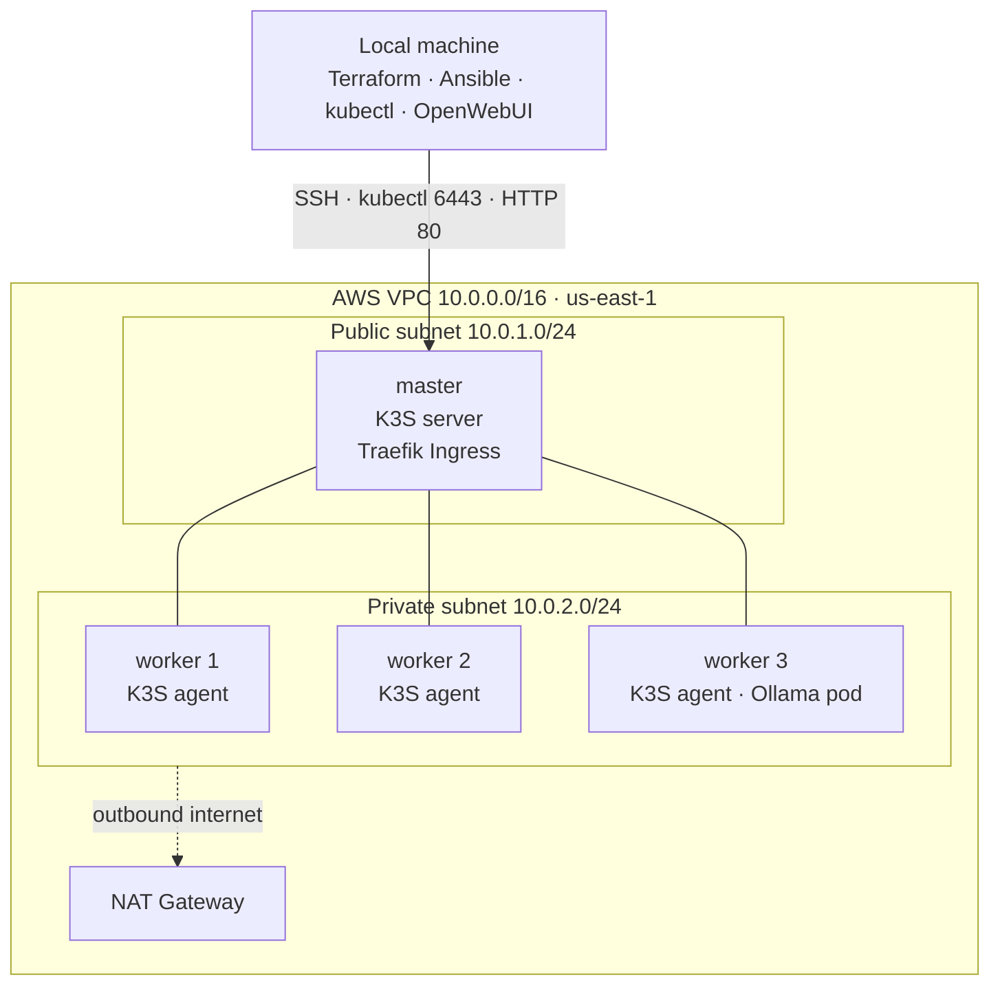

# K3S + Ollama on AWS

A self-managed Kubernetes cluster (**K3S**) on AWS, provisioned with **Terraform** and configured with **Ansible**, running an **Ollama** large language model exposed through a **Traefik Ingress**. A local **OpenWebUI** connects to the model running inside the cluster.

This is a portfolio / bootcamp final project demonstrating an end-to-end DevOps workflow: infrastructure as code, configuration management, a multi-node Kubernetes cluster, and a real workload on top of it.

## Architecture



**How a request flows:** OpenWebUI (on the laptop) sends a request to the master's public IP on port 80 → Traefik (built into K3S) receives it → the `ollama` Ingress rule routes it to the `ollama` Service → the Service forwards it to the Ollama Pod → the model answers and the response travels back the same way.

**Why the master is public and the workers are private:** the master needs to be reachable from outside for SSH, the Kubernetes API (`kubectl`), and incoming web traffic, so it sits in the public subnet with a public IP. The workers hold no public IP and cannot be reached from the internet directly (better security); they reach the internet outbound only through the NAT Gateway (to download K3S, container images, and the model). The master also acts as the bastion (jump host) that Ansible uses to reach the private workers.

## Tech stack

- **AWS** — VPC, subnets, Internet Gateway, NAT Gateway, Security Group, EC2 (Graviton / arm64)
- **Terraform** — all infrastructure as code
- **Ansible** — installs K3S (server on the master, agents on the workers)
- **K3S** — lightweight Kubernetes distribution
- **Traefik** — Ingress controller (bundled with K3S)
- **Ollama** — runs the LLM inside the cluster
- **OpenWebUI** — chat interface, runs locally in Docker

## Repository structure

```
k3s-ollama-aws/
├── terraform/        # AWS infrastructure (network, security group, EC2)
│   ├── provider.tf
│   ├── variables.tf
│   ├── vpc.tf
│   ├── routing.tf
│   ├── security-groups.tf
│   ├── ec2.tf
│   └── outputs.tf
├── ansible/          # Cluster configuration
│   ├── ansible.cfg
│   ├── inventory.ini
│   ├── playbook.yml
│   └── roles/
│       ├── k3s_master/tasks/main.yml
│       └── k3s_worker/tasks/main.yml
├── k8s/              # Kubernetes manifests
│   ├── ollama-deployment.yaml
│   ├── ollama-service.yaml
│   └── ingress.yaml
├── run-openwebui.sh  # Starts OpenWebUI locally in Docker
└── README.md
```

## Prerequisites

- An AWS account with credentials configured (`aws configure`)
- [Terraform](https://developer.hashicorp.com/terraform/downloads)
- [Ansible](https://docs.ansible.com/ansible/latest/installation_guide/index.html)
- [kubectl](https://kubernetes.io/docs/tasks/tools/)
- [Docker](https://docs.docker.com/get-docker/) (for OpenWebUI)
- An SSH key pair at `~/.ssh/k3s-ollama` (see step 0)

## Deployment

**0. Create an SSH key** (once):

```bash
ssh-keygen -t ed25519 -f ~/.ssh/k3s-ollama -C "k3s-ollama"
```

**1. Provision the infrastructure with Terraform:**

```bash
cd terraform
# create terraform.tfvars with your public IP, e.g.:  my_ip = "203.0.113.45/32"
terraform init
terraform apply
```

Terraform prints the outputs: `master_public_ip`, `master_private_ip`, `worker_private_ips`.

**2. Fill in the Ansible inventory** — put the real IPs from the Terraform outputs into `ansible/inventory.ini` (the master public IP in `[master]` and in the `ProxyJump` line, the worker private IPs under `[workers]`).

**3. Configure the cluster with Ansible:**

```bash
cd ../ansible
ansible-playbook playbook.yml
```

**4. Get cluster access on your machine** — copy the kubeconfig from the master and point it at the public IP:

```bash
scp -i ~/.ssh/k3s-ollama ubuntu@<MASTER_PUBLIC_IP>:/etc/rancher/k3s/k3s.yaml ~/.kube/k3s-ollama.yaml
sed -i '' "s/127.0.0.1/<MASTER_PUBLIC_IP>/" ~/.kube/k3s-ollama.yaml
export KUBECONFIG=~/.kube/k3s-ollama.yaml
kubectl get nodes        # should show the master + 3 workers as Ready
```

**5. Deploy Ollama and the Ingress:**

```bash
kubectl apply -f ../k8s/
```

**6. Pull a small model into Ollama:**

```bash
kubectl exec deploy/ollama -- ollama pull llama3.2:1b
```

**7. Start OpenWebUI locally** — edit `run-openwebui.sh` and set `MASTER_IP` to the master's public IP, then:

```bash
cd ..
bash run-openwebui.sh
```

Open `http://localhost:3000`, create the first account, pick the `llama3.2:1b` model and start chatting.

## Teardown

Destroy everything to stop incurring AWS charges:

```bash
cd terraform
terraform destroy
```

Also stop the local OpenWebUI container:

```bash
docker rm -f open-webui
```

## Notes

- The cluster runs on AWS Graviton (arm64) instances for lower cost.
- The NAT Gateway and running EC2 instances are the main cost while the stack is up; always `terraform destroy` when done.
- The Security Group only allows SSH, the Kubernetes API, and web ports from the operator's own IP (`my_ip`).
