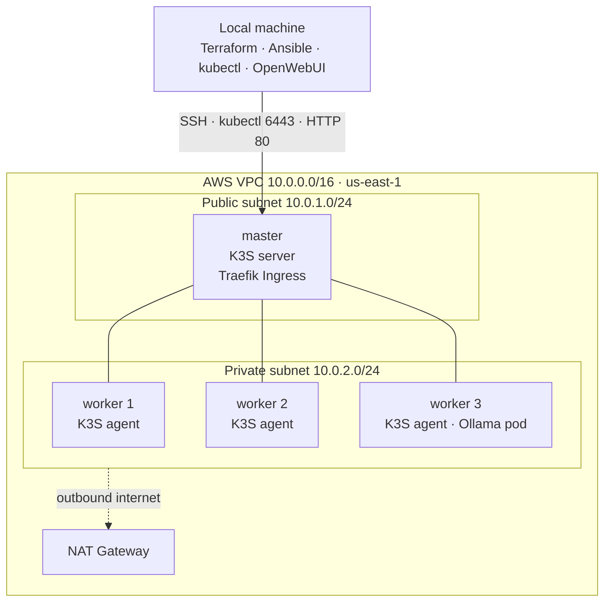

# K3S + Ollama on AWS

A self-managed Kubernetes cluster (**K3S**) on AWS — infrastructure provisioned with **Terraform**, configured with **Ansible**, running an **Ollama** large language model exposed through a **Traefik Ingress**, with a local **OpenWebUI** chat interface talking to the model inside the cluster.

The project demonstrates a full DevOps workflow end to end — infrastructure as code, configuration management, a multi-node Kubernetes cluster, and a real workload on top of it — reproducible from scratch with a single command.

## Architecture



**Request flow:** OpenWebUI (on the laptop) sends a request to the master's public IP on port 80 → Traefik (bundled with K3S) receives it → the `ollama` Ingress rule routes it to the `ollama` Service → the Service forwards it to the Ollama Pod → the model answers and the response travels back the same way.

**Why the master is public and the workers are private:** the master must be reachable from outside for SSH, the Kubernetes API (`kubectl`), and incoming web traffic, so it lives in the public subnet with a public IP. The workers hold no public IP and cannot be reached from the internet directly (tighter security); they reach the internet outbound only through the NAT Gateway, to download K3S, container images, and the model. The master also acts as the bastion (jump host) that Ansible uses to reach the private workers.

## Tech stack

- **AWS** — VPC, public/private subnets, Internet Gateway, NAT Gateway, Security Group, EC2 (t3.small master, t3.medium workers, x86 / amd64)
- **Terraform** — all infrastructure as code; also generates the Ansible inventory automatically
- **Ansible** — installs K3S (server on the master, agents on the workers), agentless over SSH
- **K3S** — lightweight Kubernetes distribution
- **Traefik** — Ingress controller (bundled with K3S)
- **Ollama** — runs the LLM (`llama3.2:1b`) inside the cluster
- **OpenWebUI** — chat interface, runs locally in Docker

## Repository structure

```
k3s-ollama-aws/
├── deploy.sh                   # one command: infra -> K3S -> Ollama -> OpenWebUI
├── destroy.sh                  # one command: tear everything down + leftover check
├── terraform/                  # AWS infrastructure as code
│   ├── provider.tf             # AWS + local providers
│   ├── variables.tf
│   ├── vpc.tf                  # VPC + public/private subnets
│   ├── routing.tf              # Internet Gateway, NAT, route tables
│   ├── security-groups.tf
│   ├── ec2.tf                  # AMI lookup, key pair, master + workers
│   ├── outputs.tf
│   └── ansible-inventory.tf    # generates ansible/inventory.ini
├── ansible/
│   ├── ansible.cfg
│   ├── inventory.tmpl          # template Terraform fills with real IPs
│   ├── playbook.yml
│   └── roles/
│       ├── k3s_master/tasks/main.yml
│       └── k3s_worker/tasks/main.yml
├── k3s/                        # Kubernetes manifests
│   ├── ollama-deployment.yaml
│   ├── ollama-service.yaml
│   └── ingress.yaml
├── run-openwebui.sh
└── README.md
```

## Prerequisites

- An AWS account with credentials configured (`aws configure`)
- [Terraform](https://developer.hashicorp.com/terraform/downloads), [Ansible](https://docs.ansible.com/ansible/latest/installation_guide/index.html), [kubectl](https://kubernetes.io/docs/tasks/tools/), and [Docker](https://docs.docker.com/get-docker/) — **Docker Desktop must be running**
- An SSH key pair at `~/.ssh/k3s-ollama` — create it once with:

```bash
ssh-keygen -t ed25519 -f ~/.ssh/k3s-ollama -C "k3s-ollama"
```

## Quick start (one command)

With the prerequisites in place, bring the whole stack up:

```bash
./deploy.sh
```

The script detects your current public IP, provisions the infrastructure, installs K3S, deploys Ollama, pulls the model, and starts OpenWebUI. When it finishes (~10 minutes), open `http://localhost:3000`, create an account, pick the `llama3.2:1b` model, and chat.

Tear everything down and confirm nothing is left running (and billing):

```bash
./destroy.sh
```

> `deploy.sh` creates real, billable AWS resources. Always run `./destroy.sh` when you are done.

The manual, step-by-step process is below if you want to run it by hand.

## Manual deployment (step by step)

**1. Provision the infrastructure with Terraform:**

```bash
cd terraform
# create terraform.tfvars with your public IP, e.g.:  my_ip = "203.0.113.45/32"
terraform init
terraform apply
```

Terraform creates the network and servers **and automatically generates `ansible/inventory.ini`** with the real IPs — no manual editing needed.

**2. Configure the cluster with Ansible:**

```bash
cd ../ansible
ansible-playbook playbook.yml
```

**3. Get cluster access on your machine:**

```bash
cd ../terraform
MASTER_IP=$(terraform output -raw master_public_ip)
mkdir -p ~/.kube
scp -i ~/.ssh/k3s-ollama -o StrictHostKeyChecking=no ubuntu@$MASTER_IP:/etc/rancher/k3s/k3s.yaml ~/.kube/k3s-ollama.yaml
sed -i '' "s/127.0.0.1/$MASTER_IP/" ~/.kube/k3s-ollama.yaml
export KUBECONFIG=~/.kube/k3s-ollama.yaml
kubectl get nodes          # master + 3 workers should be Ready
```

**4. Deploy Ollama and the Ingress:**

```bash
kubectl apply -f ../k3s/
kubectl get pods           # wait for the ollama pod to be Running 1/1
```

**5. Pull the model into Ollama:**

```bash
kubectl exec deploy/ollama -- ollama pull llama3.2:1b
```

**6. Start OpenWebUI locally:**

```bash
docker run -d \
  -p 3000:8080 \
  -e OLLAMA_BASE_URL=http://$MASTER_IP \
  -v open-webui:/app/backend/data \
  --name open-webui \
  ghcr.io/open-webui/open-webui:main
```

Open `http://localhost:3000`, create the first account, select `llama3.2:1b`, and start chatting.

## Teardown — always run when done (avoids ongoing charges)

Easiest: `./destroy.sh`. Or manually:

```bash
cd terraform
terraform destroy
docker rm -f open-webui
```

Then confirm nothing expensive is left:

```bash
aws ec2 describe-nat-gateways --filter "Name=state,Values=available,pending" --query "NatGateways[].NatGatewayId" --output text
aws ec2 describe-addresses --query "Addresses[].PublicIp" --output text
```

Both should be empty. Tip: set an **AWS Budgets** alert so you are notified of unexpected spend.

## Troubleshooting

- **Ansible: a worker is `UNREACHABLE`** — the servers are still booting. Wait a minute and re-run `ansible-playbook playbook.yml`.
- **SSH or kubectl times out reaching the master** — your public IP changed. Update `my_ip` in `terraform.tfvars`, run `terraform apply` again, then retry. (`deploy.sh` handles this automatically.)
- **Ollama pod stuck in `Evicted` / `DiskPressure`** — the node ran out of disk. The config uses a 30 GB root volume, so re-create the servers with a fresh `terraform apply`.
- **OpenWebUI shows "No models available"** — its saved Ollama address is stale. Open Settings → Admin Settings → Connections and set the Ollama API URL to `http://<MASTER_IP>`, then refresh. Confirm the backend works with `curl http://<MASTER_IP>/api/tags`. A clean restart also fixes it: `docker rm -f open-webui; docker volume rm open-webui`, then start it again.

## Key implementation details

- **One-command deploy/destroy** (`deploy.sh` / `destroy.sh`), including automatic public-IP detection and a teardown check that confirms no billable resources are left.
- **Terraform generates the Ansible inventory** (`local_file` + `templatefile`), so the real server IPs are filled in automatically on every `apply`.
- **Private workers are reached through the master** using an SSH `ProxyCommand` (bastion pattern), since they have no public IP.
- **Node disk is sized at creation** (`root_block_device`, 30 GB) so container images and the model fit; the filesystem is grown automatically on first boot.
- **Security Group** only allows SSH, the Kubernetes API, and the web ports from the operator's own IP (`my_ip`), while cluster nodes trust each other internally.
