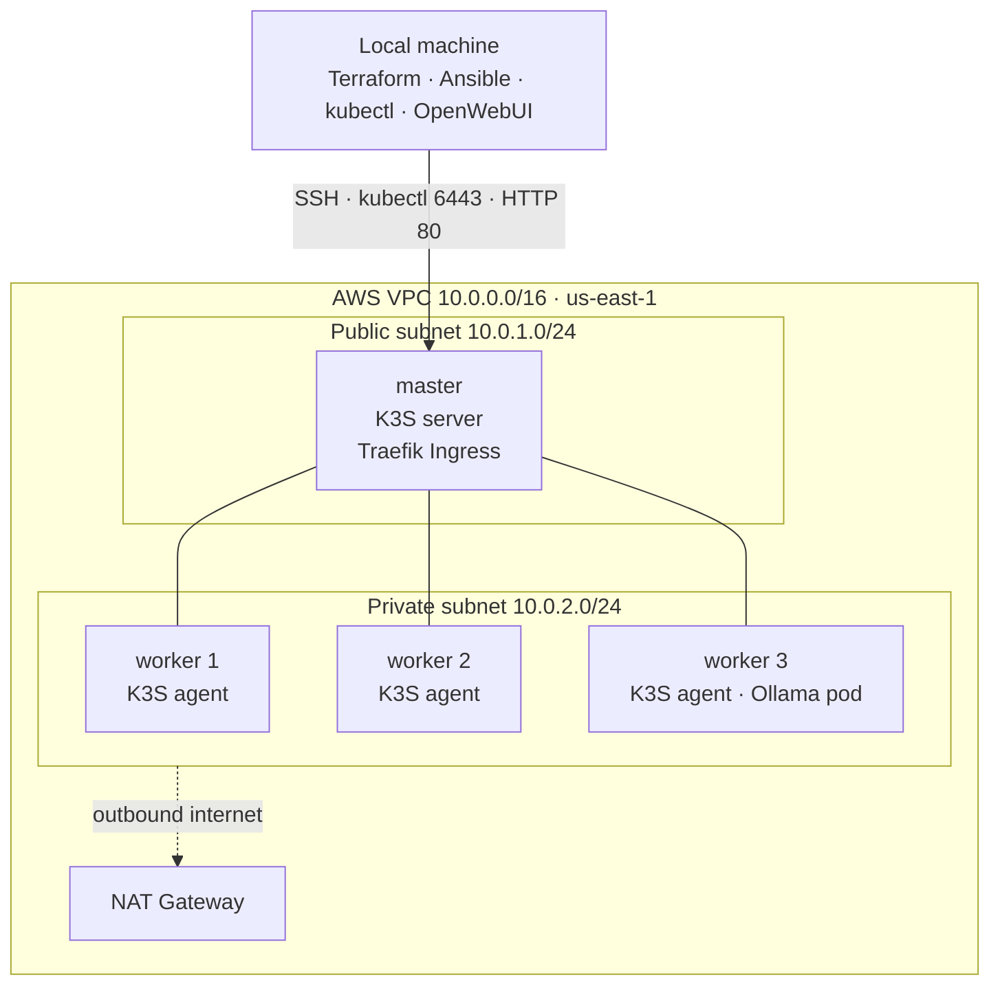

# K3S + Ollama on AWS

A self-managed Kubernetes cluster (**K3S**) on AWS — infrastructure provisioned with **Terraform**, configured with **Ansible**, running an **Ollama** large language model exposed through a **Traefik Ingress**, with a local **OpenWebUI** chat interface talking to the model inside the cluster.

The project demonstrates a full DevOps workflow end to end — infrastructure as code, configuration management, a multi-node Kubernetes cluster, and a real workload on top of it — reproducible from scratch with a handful of commands.

## Architecture



**Request flow:** OpenWebUI (on the laptop) sends a request to the master's public IP on port 80 → Traefik (bundled with K3S) receives it → the `ollama` Ingress rule routes it to the `ollama` Service → the Service forwards it to the Ollama Pod → the model answers and the response travels back the same way.

**Why the master is public and the workers are private:** the master must be reachable from outside for SSH, the Kubernetes API (`kubectl`), and incoming web traffic, so it lives in the public subnet with a public IP. The workers hold no public IP and cannot be reached from the internet directly (tighter security); they reach the internet outbound only through the NAT Gateway, to download K3S, container images, and the model. The master also acts as the bastion (jump host) that Ansible uses to reach the private workers.

## Tech stack

- **AWS** — VPC, public/private subnets, Internet Gateway, NAT Gateway, Security Group, EC2 (t3.small master, t3.medium workers, x86 / amd64)
- **Terraform** — all infrastructure as code; also generates the Ansible inventory automatically
- **Ansible** — installs K3S (server on the master, agents on the workers), agentless over SSH
- **K3S** — lightweight Kubernetes distribution
- **Traefik** — Ingress controller (bundled with K3S)
- **Ollama** — runs the LLM (`llama3.2:1b`) inside the cluster
- **OpenWebUI** — chat interface, runs locally in Docker

## Repository structure

```
k3s-ollama-aws/
├── terraform/                  # AWS infrastructure as code
│   ├── provider.tf             # AWS + local providers
│   ├── variables.tf
│   ├── vpc.tf                  # VPC + public/private subnets
│   ├── routing.tf              # Internet Gateway, NAT, route tables
│   ├── security-groups.tf
│   ├── ec2.tf                  # AMI lookup, key pair, master + workers
│   ├── outputs.tf
│   └── ansible-inventory.tf    # generates ansible/inventory.ini
├── ansible/
│   ├── ansible.cfg
│   ├── inventory.tmpl          # template Terraform fills with real IPs
│   ├── playbook.yml
│   └── roles/
│       ├── k3s_master/tasks/main.yml
│       └── k3s_worker/tasks/main.yml
├── k3s/                        # Kubernetes manifests
│   ├── ollama-deployment.yaml
│   ├── ollama-service.yaml
│   └── ingress.yaml
├── run-openwebui.sh
└── README.md
```

## Prerequisites

- An AWS account with credentials configured (`aws configure`)
- [Terraform](https://developer.hashicorp.com/terraform/downloads), [Ansible](https://docs.ansible.com/ansible/latest/installation_guide/index.html), [kubectl](https://kubernetes.io/docs/tasks/tools/), and [Docker](https://docs.docker.com/get-docker/) — **Docker Desktop must be running** for step 7
- An SSH key pair at `~/.ssh/k3s-ollama` (step 0 creates it)

> Run all deployment commands in the **same terminal window**: several steps rely on the `MASTER_IP` variable and the `KUBECONFIG` setting, which only live in the current shell. Full build time is roughly **8–12 minutes**.

## Deployment

### 0. Create an SSH key (once)

```bash
ssh-keygen -t ed25519 -f ~/.ssh/k3s-ollama -C "k3s-ollama"
```

### 1. Provision the infrastructure with Terraform (~3 min)

The Security Group only allows your own IP, so set your **current** public IP first. Find it with:

```bash
curl https://checkip.amazonaws.com
```

Create (or edit) `terraform/terraform.tfvars` with that IP:

```hcl
my_ip = "YOUR_PUBLIC_IP/32"
```

Then apply:

```bash
cd terraform
terraform init      # first time only
terraform apply     # review the plan, type: yes
```

Terraform builds the network and four servers, and **automatically generates `ansible/inventory.ini`** with the real IPs. Wait for `Apply complete!`.

> If you run this from a different network than before, your public IP has changed — always refresh `my_ip` here, or the servers will refuse the connection.

### 2. Install K3S with Ansible (~2 min)

Give the servers about a minute to finish booting, then:

```bash
cd ../ansible
ansible-playbook playbook.yml
```

In the `PLAY RECAP`, all four hosts should show `unreachable=0` and `failed=0`. If a worker shows `unreachable` (still booting), just run the command again — it is safe to repeat.

### 3. Connect kubectl (~1 min)

```bash
cd ../terraform
MASTER_IP=$(terraform output -raw master_public_ip)
mkdir -p ~/.kube
scp -i ~/.ssh/k3s-ollama -o StrictHostKeyChecking=no ubuntu@$MASTER_IP:/etc/rancher/k3s/k3s.yaml ~/.kube/k3s-ollama.yaml
sed -i '' "s/127.0.0.1/$MASTER_IP/" ~/.kube/k3s-ollama.yaml
export KUBECONFIG=~/.kube/k3s-ollama.yaml
kubectl get nodes
```

All four nodes should become `Ready` (workers may need an extra minute — re-run `kubectl get nodes`). If the first `kubectl` call is slow to respond, wait a few seconds and retry.

> `sed -i ''` is the macOS form. On Linux use `sed -i "s/127.0.0.1/$MASTER_IP/" ~/.kube/k3s-ollama.yaml` (no empty quotes).

### 4. Deploy Ollama and the Ingress (~2 min)

```bash
kubectl apply -f ../k3s/
kubectl get pods
```

Wait until the `ollama` pod is `Running` and `1/1` (it pulls the image first).

### 5. Pull the model into Ollama (~1 min)

```bash
kubectl exec deploy/ollama -- ollama pull llama3.2:1b
```

Wait for `success`.

### 6. Verify the path from outside (optional)

```bash
curl http://$MASTER_IP/api/tags   # should list llama3.2:1b
```

### 7. Start OpenWebUI locally

Make sure Docker Desktop is running, then:

```bash
docker run -d \
  -p 3000:8080 \
  -e OLLAMA_BASE_URL=http://$MASTER_IP \
  -v open-webui:/app/backend/data \
  --name open-webui \
  ghcr.io/open-webui/open-webui:main
```

Wait about 30 seconds, then open `http://localhost:3000`. Create the first account (any email and password — the first user becomes admin), select the `llama3.2:1b` model, and start chatting.

> If Docker says the name is already in use, remove the old container first: `docker rm -f open-webui`, then run the command again.

## Teardown — always run when done (avoids ongoing charges)

The NAT Gateway and running EC2 instances cost money for as long as they exist, so destroy the stack as soon as you are finished:

```bash
cd terraform
terraform destroy
docker rm -f open-webui
```

Tip: set an **AWS Budgets** alert (e.g. notify above $5) so you are told immediately if something is left running.

## Troubleshooting

- **Ansible: a worker is `UNREACHABLE`** — the servers are still booting. Wait a minute and re-run `ansible-playbook playbook.yml` (it is idempotent).
- **SSH or kubectl times out reaching the master** — your public IP changed. Update `my_ip` in `terraform.tfvars`, run `terraform apply` again to refresh the Security Group, then retry.
- **Ollama pod stuck in `Evicted` / `DiskPressure`** — the node ran out of disk. The config uses a 30 GB root volume, so re-create the servers with a fresh `terraform apply`.
- **`docker run` says the name is already in use** — run `docker rm -f open-webui`, then start it again.
- **OpenWebUI does not show the model** — confirm `curl http://$MASTER_IP/api/tags` lists `llama3.2:1b`, then refresh the page.

## Key implementation details

- **Terraform generates the Ansible inventory** (`local_file` + `templatefile`), so the real server IPs are filled in automatically on every `apply` — nothing is typed by hand.
- **Private workers are reached through the master** using an SSH `ProxyCommand` (bastion pattern), since they have no public IP.
- **Node disk is sized at creation** (`root_block_device`, 30 GB) so container images and the model fit; the filesystem is grown automatically on first boot.
- **Security Group** only allows SSH, the Kubernetes API, and the web ports from the operator's own IP (`my_ip`), while cluster nodes trust each other internally.
